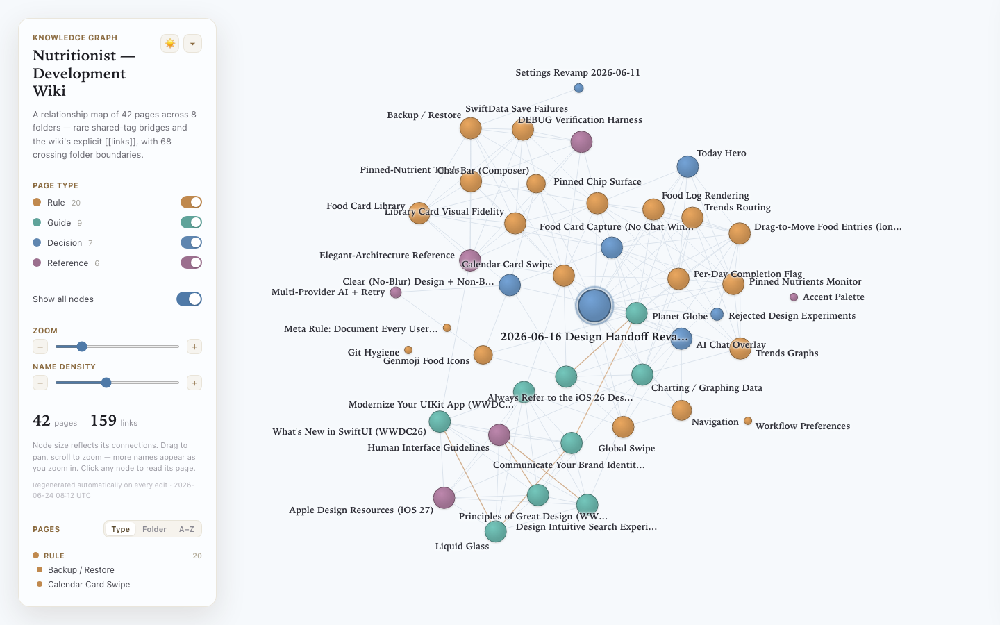

# Nutritionist — Development Wiki

Design decisions, locked rules, and engineering invariants for the **Nutritionist** iOS app.
It is a plain-Markdown **Open Knowledge Format (OKF)** knowledge base — every folder has an
`index.md` catalog and every page carries YAML frontmatter with a required `type` — served to
coding agents over MCP by [wiki-as-an-mcp](https://github.com/taikunudel/wiki-as-an-mcp).

## 🌐 Live interactive graph

**▶ [Open the live, interactive graph »](https://raw.githack.com/taikunudel/knowledge-iosapp/v1/graph.html)**

Drag to pan, scroll or use the **Zoom** slider, and click any node to read its page in a side
drawer (with its frontmatter, as tidy **Details** or **Raw** YAML). Dots are colored by page
**type**; the edges are the relationships between pages — shared *rare* tags (IDF-weighted, so
"everything is in design" draws no line) plus explicit `[[wikilinks]]`. The panel also has a
**Name density** slider, a **Type / Folder / A–Z** page directory, and a **dark-mode** toggle.

> `graph.html` is regenerated automatically every time the wiki is edited through the MCP, so the
> live graph always reflects the current state of the base.

## What's inside

42 pages across 8 areas — `workflow/`, `design-system/`, `navigation/`, `today/`, `food-entry/`,
`trends/`, `ai/`, `engineering/`. Start from the catalog in [`index.md`](index.md).

## Format

An OKF bundle: plain Markdown + YAML on disk, with no database or platform required to read it.
The only non-knowledge files are the reserved root files — `index.md` (catalog), `log.md`
(history), `README.md` (this page) — and the generated `graph.html`; everything else is a typed
knowledge page.
